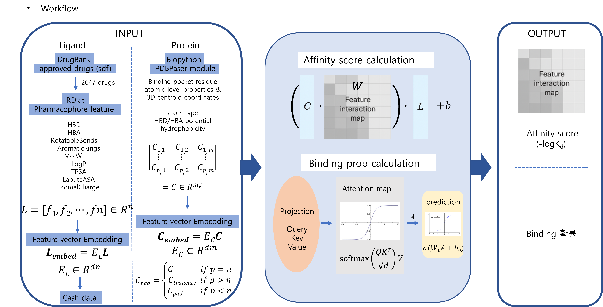

### Ligand–Pocket Binding Affinity Model

Development of a deep learning model to predict ligand–protein binding affinity using structural information.

The model was designed to support **drug repurposing studies** by estimating the binding potential of existing drug molecules against target protein pockets.

Key features:

- Ligand feature extraction and embedding generation
- Protein pocket residue feature extraction from PDB structures
- Residue-level pocket embeddings
- Attention-based interaction modeling between ligand and pocket
- Binding affinity regression trained on the **PDBbind refined dataset**
- Drug candidate screening using **DrugBank compounds**

The model learns interaction patterns between ligand features and protein pocket residues to estimate binding affinity.

